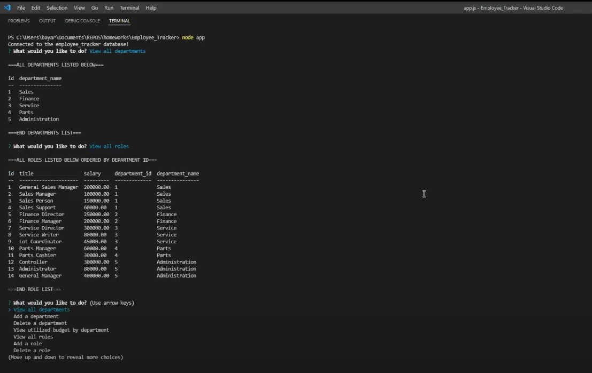

  # Employee Tracker CMS

  **VIDEO LINK:** https://drive.google.com/file/d/141tx0GyQmykqdsD9BirOFdIuXCwp0djH/view

  ## **Description**
   
  - Employee tracker CMS is a user friendly organizational content manager system. It helps businesses maintain record of departments, roles, and employee structures- and can even track the utilized budget for each department. The application can be configured to suit any company or corporate team structure, but comes preconfigured for a standard car dealership- including a sales, finance, service, parts, and admin departments. Users can create, view, update, and delete departments, roles, and add employees. Employees can be tracked by department and by manager to easily keep track of team structures in a single database. 
  - This application was written using JavaScript, ES6, Node
  - Employee Tracker CMS solves the problem of team management and organization, while making it easy for the user to track and update departments, roles, and employees. 
  - Creating this application increased my foundational understanding of JavaScript overall, while also introducing new skills such as creating a database and server and preparing them for front-end delivery. 

  ## **Table of Contents** 
  
  - [installation](#installation)
  - [Usage](#usage)
  - [Credits](#credits)
  - [License](#license)

  ## **Installation**
  
  1.) Clone the git repo to your local machine. 2.) Open the download in your favorite code editor. 3.) Run `npm i` to install all of the dependencies. 4.) Run the application using `node app` to start the application. 

  ## **Usage**

  Users can download the code and follow the steps above and immediately have access to a car dealership format. Simply follow the prompts to choose how you would like to interact with the application. To change company structure, simply delete the preconfigured departments, roles, and employees to start. Futhermore, the application is prepared for front-end development if a company wishes to take the structure and implement it with a client side interface. API routes are included in the Routes directory and can be accessed by starting a server using `npm start`. 

  ## **Credits** 

  This project was built by Michael Cortez-Mejia 

  
  ## **License**

  

  To see more info regarding this license, please visit https://choosealicense.com/licenses/mit/
  

  ## **How to Contribute**

  If you would like to add/contribute to the project, feel free to fork from GitHub @MCORTEZM1 
  Or click here: https://github.com/MCORTEZM1/Employee_Tracker

  ## **Questions / Contact Me**

  Please reach out with any questions or concerns directly to: MCortezmM@yahoo.com

## **Tests**

  Simply start the application and try to add, update, and delete! 
  
